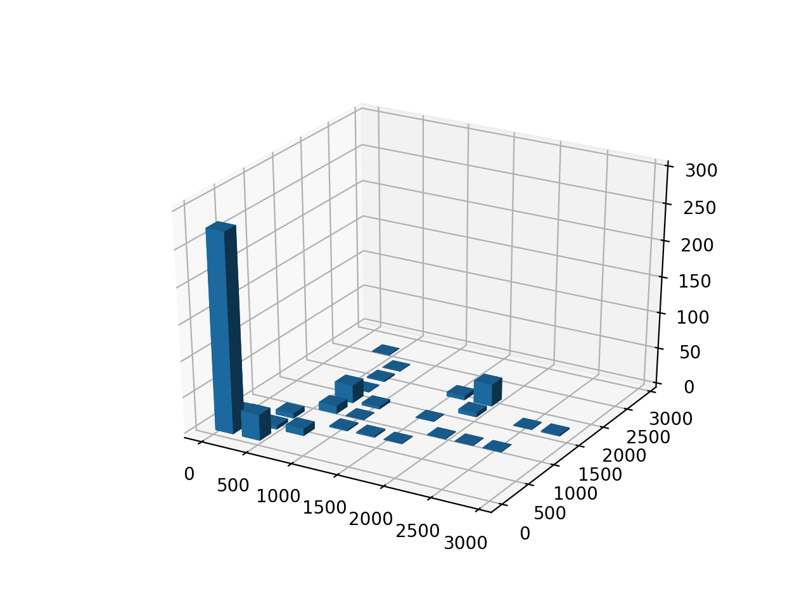
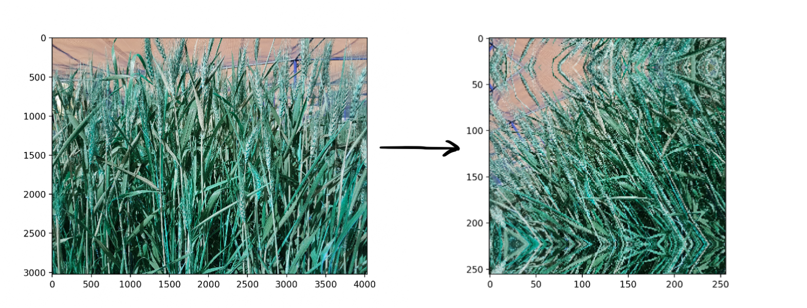
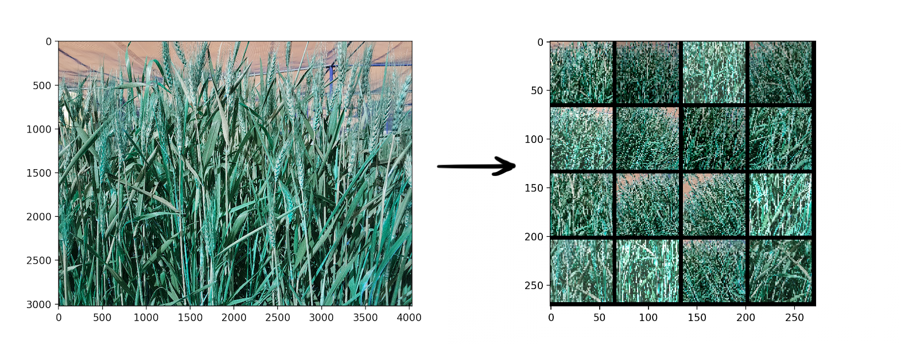
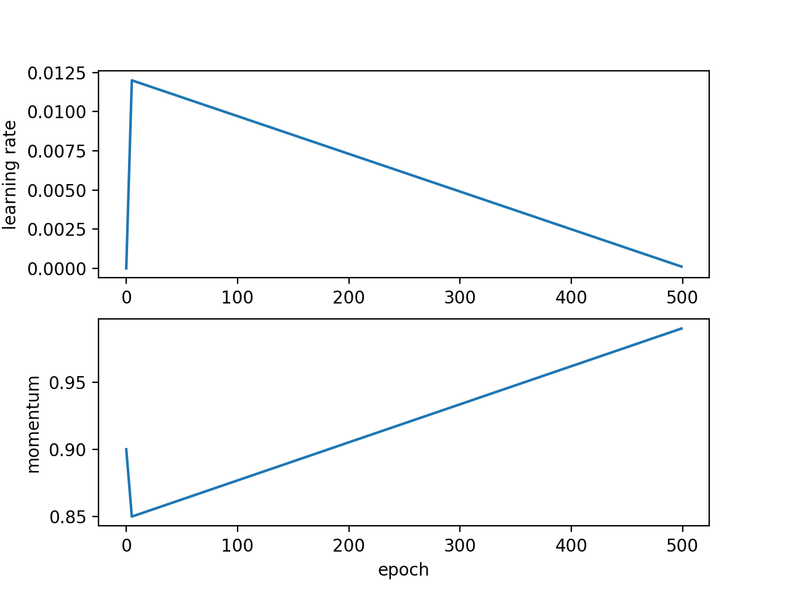

# CGIAR Computer Vision for Crop Disease

This is the project for [CGIAR Computer Vision for Crop Disease](https://zindi.africa/competitions/iclr-workshop-challenge-1-cgiar-computer-vision-for-crop-disease/)
&mdash; computer vision competition for identification wheat rust in images from Ethiopia and Tanzania.
It relates to the problem of multiclass classification, where every image of crop is labeled as healthy or having one
of two diseases. My approach is based on resnet18 &mdash; a pretrained convolutional neural network that
can classify images into 1000 categories. This solution ended up at 155th place in the competition.

## Table of contents

* [Project layout](#project-layout)
* [Data overview](#data-overview)
* [Solution details](#solution-details)
* [How to run](#how-to-run)
  * [Requirements](#requirements)
  * [Dataset](#dataset)
  * [Preprocessing](#preprocessing)
  * [Training](#training)
  * [Evaluation](#evaluation)
* [Download](#download)


## Project layout

```
.
├── input             # Input files provided by competition.
│   ├── train         # Train images split into categories.
│   ├── test          # Test images.
│   ├── train_clean   # Preprocessed train images split into categories.
│   └── test_clean    # Preprocessed test images.
├── logdir            # Trained models output path.
├── models            # Pth files of trained models used in inference.
├── src               # Solution source code.
├── config.yml        # Catalyst configuration.
└── folds.csv         # Images split into folds.
```

## Data overview
The dataset consists of 875 colored images of crops. The images have different file format.
The dataset is split into three non equal parts, each part identifies a class of crop.
Here is the bar graph of class proportions:


My solution is based on a neural network for which the size of the image
is critical, so let's see the disribution of image sizes. Here is the distribution of image
size in train dataset:


## Solution details

### Images

First problem we face with this dataset &mdash; while most of the images are small,
there are still large ones that need to be fed to the neural network which
can only take images of fixed size. In this project I tested two approaches
to solve this problem:

1. Resize all images to make them equal-sized. This is a classical approach.
It also has proven to be the most precise in this competition.
My most accurate prediction model is based on it. Here is example of image
transformed this way:


2. Crop `NxN` random squares from an image. This approach seems to be better than previous
one, but in practice it gives worse results. This might happen because cropped images
are too small for the neural network to capture all details significant for prediction.
Here is example of image transformed this way:


### Neural network

#### Optimizer

In this project AdamW optimizer is used instead of Adam to train the neural network.
The optimiser shows better empirically model generalization results because
it performs weight decay to reduce overfitting effect.

#### Scheduler

This solution uses OneCycleLRWithWarmup scheduler. On warmup steps, it increases learning rate
to its maximum and decreases momentum to its minimum. On annealing stage it decreases
learning rate and increases momentum.


## How to run

### Requirements
Here is list of requirements you need to run the project. Other versions
are not tested:

- Python 3.7.6
- Pytorch 1.4.0
- Numpy 1.18.1
- Pandas 1.0.1
- OpenCV 4.2.0.32
- Albumentations 0.4.5
- Catalyst 20.2.4
- Cnn-finetune 0.6.0
- Tqdm 4.43.0

To install them you can use:
```
pip install -r requirements.txt
```

### Dataset

To run the project you also need to dowload dataset:

1. Download train dataset using following link: [train.zip](https://api.zindi.africa/v1/competitions/iclr-workshop-challenge-1-cgiar-computer-vision-for-crop-disease/files/train.zip).
2. Download test dataset using following link: [test.zip](https://api.zindi.africa/v1/competitions/iclr-workshop-challenge-1-cgiar-computer-vision-for-crop-disease/files/test.zip).
3. Unpack `train.zip` into `input/train` directory.
4. Unpack `test.zip` into `input/test` directory.

### Preprocessing

As it was mentioned in 'Data overview' section, images have different file formats.
Therefore we convert them to the same format so that it is easier to process them.

#### On MacOS
```
sips -s format png input/train/healthy_wheat/* --out input/train_clean/healthy_wheat
sips -s format png input/train/leaf_rust/* --out input/train_clean/leaf_rust
sips -s format png input/train/stem_rust/* --out input/train_clean/stem_rust
sips -s format png input/test/* --out input/test_clean
```

#### On Linux
You need to install `imagemagick` package, after you can run:
```
mogrify -path input/train_clean/healthy_wheat -format png input/train/healthy_wheat/* 
mogrify -path input/train_clean/leaf_rust -format png input/train/leaf_rust/* 
mogrify -path input/train_clean/stem_rust -format png input/train/stem_rust/* 
mogrify -path input/test_clean -format png input/test/* 
```

### Training

To train a model you shuold use `catalyst-dl` utility (comes after installing catalyst):
```
catalyst-dl run --config=./config.yml --verbose
```
Then you can find trained model in `logdir/checkpoints/` directory.

### Evaluation

To make predictions using trained model you use `src/inference.py` script:
```
python src/inference.py <path/to/trained/model> <path/to/test_clean> <output file name>
```

## Download

These models were used to make predictions:

* [resnet18_600ep.pth](https://github.com/silentz/cv_crop_disease/raw/master/models/resnet18_600ep_best.pth)
* [resnet18_2000ep.pth](https://github.com/silentz/cv_crop_disease/raw/master/models/resnet18_2000ep_best.pth)
* [resnet18_3000ep.pth](https://github.com/silentz/cv_crop_disease/raw/master/models/resnet18_3000ep_best.pth)
